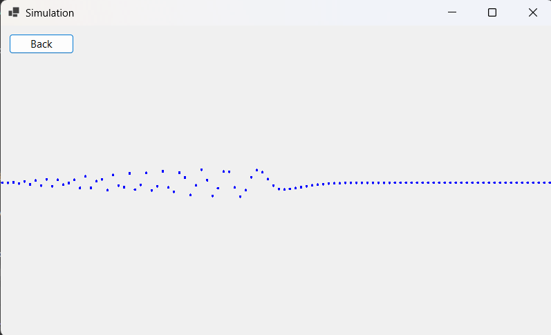
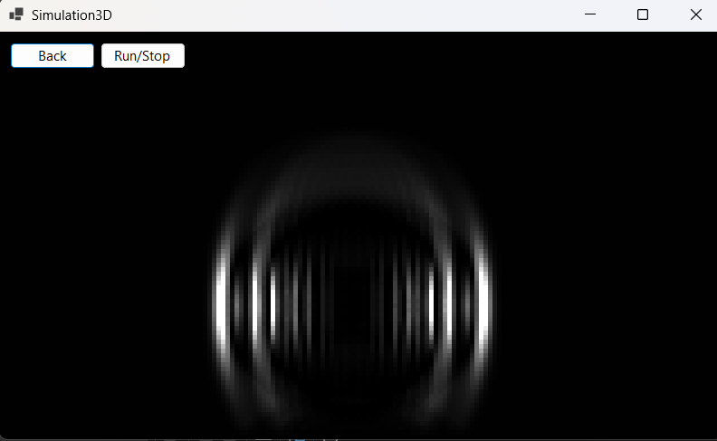
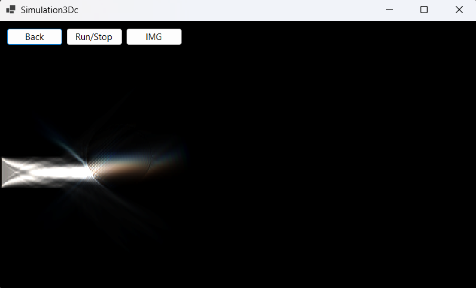

# Проект Simulation (ThreeWindowsApp)

## Описание
Проект Simulation представляет собой симуляцию поведения волн в различных измерениях. Он разработан на платформе .NET 8 и включает несколько классов для управления и визуализации симуляций.

## Возможности
- Симуляция поведения волн в 1D
- Симуляция поведения волн в 2D
- Симуляция поведения волн в 2D с использованием трех цветов (RGB)

Волны рассчитываются с использованием массивов `buff`, `atm`, `weight` и `a`. Основная логика заключается в следующем:
1. Значения в массиве `buff` обновляются как среднее значение соседних элементов массива `atm`.
2. Значения в массиве `a` обновляются на основе разницы между `buff` и `atm`, умноженной на весовой коэффициент из массива `weight`.
3. Значения в массиве `atm` обновляются на основе значений в массиве `a`.

Вдохновлялся [этим плейлистом](https://youtube.com/playlist?list=PLZHQObOWTQDMKqfyUvG2kTlYt-QQ2x-ui&si=BsFC0zWApGGpb-Rg)

## Скриншоты

### 1D

### 2D

## 2Dc

## Изображения, сделанные с помощью экспорта

PS: с точки зрения чисел здесь везде +1 измерение ко всем симуляциям, все из за импульса, который надо где то хранить, поэтому и в коде и названиях окон фигурируют 2D, 3D..., но это измерение при обычных условиях срыто, поэтому для меньшей путаницы использовано упрощение